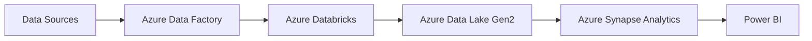
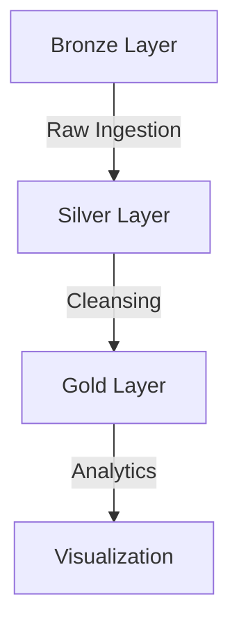

<div align="center">

# 🌍 Global Renewable Energy Analysis Platform

### An End-to-End Data Engineering Solution for analyzing renewable energy adoption, economic factors, and climate patterns across different countries.

[](https://github.com/yourusername/project-name)
[](https://azure.microsoft.com/)
[](https://powerbi.microsoft.com/)
[](https://spark.apache.org/)
[](https://databricks.com/)


</div>

## 📊 Project Overview

> Transforming global renewable energy data into actionable insights

This project leverages advanced cloud technologies to analyze the intricate relationships between renewable energy adoption, economic growth, and climate factors worldwide. Through interactive visualizations and comprehensive data processing, we empower stakeholders to make informed decisions about renewable energy initiatives.

### 🎯 Key Analysis Areas

| Area | Description |
|------|-------------|
| 💹 Energy vs GDP | Analyzing renewable energy share impact on economic growth |
| 🌡️ Temperature Analysis | Seasonal and geographical temperature pattern study |
| ⚡ Efficiency Metrics | Cross-country renewable energy efficiency comparison |
| 🌱 Sustainability Impact | Assessment of environmental and economic sustainability |
| 🌪️ Weather Impact | Analysis of weather severity on CO₂ emissions |
| 📈 Financial Patterns | Tracking seasonal financial flow variations |

## 🏗️ Architecture

Our solution employs a modern data platform architecture using Azure services:



### Data Flow

<details>
<summary>1️⃣ Data Sources</summary>

- 📊 Population Data (AWS S3)
- ☁️ Weather Data (Azure SQL Database)
- 📈 Energy Data (GitHub)
</details>

<details>
<summary>2️⃣ Data Processing Pipeline</summary>

- 🏭 Azure Data Factory for orchestration
- 🔄 Azure Databricks for transformation
- 💾 Azure Data Lake Storage Gen2
- 🏢 Azure Synapse Analytics
</details>

<details>
<summary>3️⃣ Visualization Layer</summary>

- 📊 Power BI dashboards
- 🔄 Real-time data updates
- 📱 Interactive visualizations
</details>

## 📦 Datasets

Our analysis is powered by three comprehensive datasets:

### 🌤️ Weather Dataset (1.8M+ rows)
```python
{
    "metrics": ["Daily meteorological data", "Temperature metrics"],
    "geographical": ["Precipitation", "Snow data", "Coordinates"]
}
```

### ⚡ Energy Dataset (69K+ rows)
```python
{
    "production": ["Energy metrics", "Renewable statistics"],
    "economic": ["GDP indicators", "Carbon emissions"]
}
```

### 👥 Population Dataset (2.5K+ rows)
```python
{
    "demographics": ["Population density", "Urban metrics"],
    "migration": ["Movement patterns", "Regional statistics"]
}
```

## 🔄 Data Processing

We implement the Medallion Architecture for robust data processing:



## 🔒 Security Implementation

```python
security_features = {
    "key_management": "Azure Key Vault",
    "authentication": "Azure Active Directory",
    "access_control": "Role-based (RBAC)",
    "data_protection": "Secure storage & transmission"
}
```

## 🛠️ Technology Stack

<div align="center">

| Category | Technologies |
|----------|-------------|
| **Cloud Platform** |  |
| **Data Processing** |   |
| **Storage** |  |
| **Visualization** |  |
| **Programming** |   |

</div>

## 🎯 Key Benefits

- 📊 Data-driven renewable energy decisions
- 💰 Comprehensive economic impact analysis
- 🌡️ Advanced climate pattern correlation
- 📱 Interactive visualization capabilities
- 🔄 Real-time data processing
- 🔒 Enterprise-grade security

---

<div align="center">

Built with ❤️ by Raghul K

[](https://linkedin.com/in/raghulk/)

</div>
